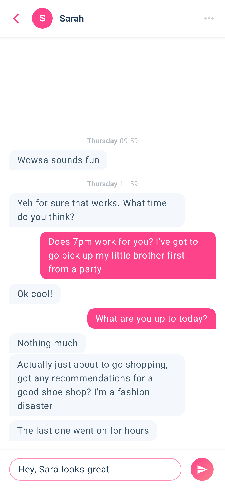
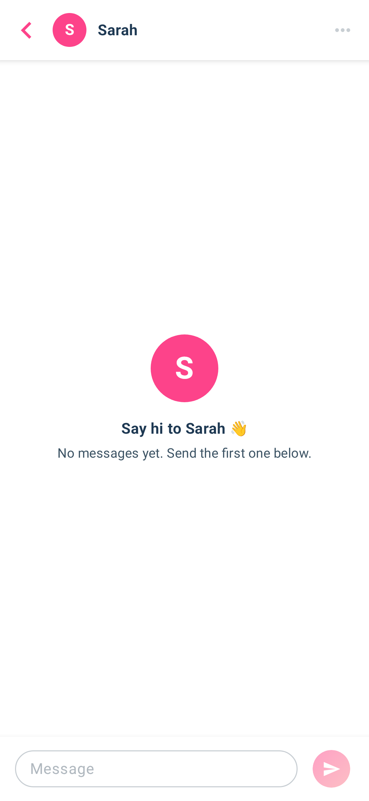

# MuzzChat

A single chat screen between two fixed users, built for the Muzz Android exercise.

| Chat | Empty |
|---|---|
|  |  |

Demo recording: [demo.mp4](demo.mp4)

## Usage
- Switch users from the ⋯ menu ("Switch to Sarah").
- Unit tests: `./gradlew testDebugUnitTest`
- Screenshot tests: `./gradlew validateDebugScreenshotTest`. To re-record after an intended UI change: `updateDebugScreenshotTest`.

## Architecture
```
Room ──Flow──▶ ChatRepository ──▶ ChatViewModel ──StateFlow<ChatUiState>──▶ Compose UI
                                   └ ChatItemMapper (headers + spacing)
```
- `domain/`: `Message`, `ChatUser`, and the `ChatRepository` interface.
- `data/`: Room entity, DAO and database, plus `RoomChatRepository`.
- `di/`: Hilt module.
- `ui/chat/`: screen, ViewModel, mapper and components.

## Decisions
- **MVVM with a single UI state:** the ViewModel exposes one `StateFlow<ChatUiState>`. The input text is plain Compose state, because a `TextField` needs synchronous updates.
- **Pure mapper:** `ChatItemMapper` turns messages into list rows (section headers, tight spacing, mine/theirs). It has no Android code, and the zone and locale are injected, so it's fully unit tested.
- **Room `Flow` as the source of truth:** the UI observes the database, so a new message shows up automatically.
- **Two-way messaging:** two fixed users. "Switch user" flips who is typing, and alignment comes from `senderId`.
- **RTL support:** start/end alignment, mirrored bubbles, and per-message text direction (`TextDirection.Content`), so Arabic and English mix correctly.
- **Empty state instead of seed data**, with a loading flag so it doesn't flash on launch.
- **Back asks "Leave chat?"** before closing the app. The trade-off: it disables the predictive back animation on Android 14+.
- **Screenshot tests** use Google's Compose Preview Screenshot Testing. I'd have liked Paparazzi, but it isn't compatible with AGP 9 / Gradle 9 yet. This is my first time writing screenshot tests.

## Assumptions
- Headers use "{weekday} HH:mm" as specified, in 24-hour time.
- "More than 1 hour" and "less than 20 seconds" are strict comparisons.
- minSdk is 26 so `java.time` can be used without desugaring.

## Limitations / with more time
- For messages older than a week, the weekday is ambiguous. I'd show Today / Yesterday / weekday / date instead.
- The 1-hour header rule is hard to show in a fresh demo, because it needs messages over an hour apart. Unit tests cover it.
- No read ticks or delivery status, no avatar photos, and light theme only.
- No pagination for long chats.
- Some dependencies are pinned below latest (Compose BOM, hilt-lifecycle-viewmodel-compose 1.3.0, coroutines 1.10.2), because newer versions need AGP 9.1+, which my Android Studio doesn't support yet.

## Tests
- `ChatItemMapperTest`: headers, spacing boundaries and mine/theirs.
- `ChatViewModelTest`: send, trim, blank input, switch user and loading, using a fake repository and Turbine.
- 8 screenshot tests: bubbles (LTR and RTL), header, input bar (LTR and RTL), empty state, and the full chat with and without messages.
